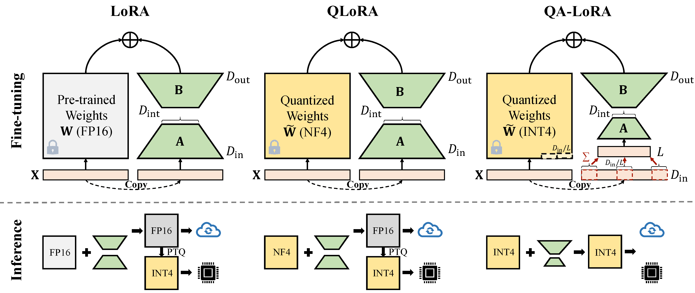

# QA-LoRA

This repository provides the PyTorch implementation of [QA-LoRA: Quantization-Aware Low-Rank Adaptation of Large Language Models](https://arxiv.org/pdf/2309.14717.pdf)

<div align="center">
  
</div>

QA-LoRA is easily implemented with a few lines of code, and it equips the original LoRA with two-fold abilities: (i) during fine-tuning, the LLM's weights are quantized (e.g., into INT4) to reduce time and memory usage; (ii) after fine-tuning, the LLM and auxiliary weights are naturally integrated into a quantized model without loss of accuracy.

## Installation
```bash
conda create -n qalora python=3.8
conda activate qalora
pip install torch torchvision torchaudio --index-url https://download.pytorch.org/whl/cu117
git clone -b peft_integration https://github.com/PanQiWei/AutoGPTQ.git && cd AutoGPTQ
pip install .[triton]
cd ..
git clone https://github.com/timdettmers/bitsandbytes.git
cd bitsandbytes
# CUDA_VERSIONS in {110, 111, 112, 113, 114, 115, 116, 117, 118, 119, 120, 120}
# make argument in {cuda110, cuda11x, cuda12x}
# if you do not know what CUDA you have, try looking at the output of: python -m bitsandbytes
CUDA_VERSION=117 make cuda11x
python setup.py install
cd ..
pip install git+https://github.com/huggingface/transformers.git
pip install git+https://github.com/huggingface/peft.git
pip install git+https://github.com/huggingface/accelerate.git
pip install -r requirements.txt
pip install protobuf==3.20.*
```
Change the `peft_utils.py` in your own auto-gptq path(python path/auto_gptq/utils/peft_utils.py) with the new one.
For the users of [GPTQLORA](https://github.com/qwopqwop200/gptqlora), you only need to change the `peft_utils.py` file.

## Quantization
We use [GPTQ](https://github.com/qwopqwop200/GPTQ-for-LLaMa) for quantization. 
bits=4, group-size=32, act-order=False
If you change the group-size, you need to change the group_size in `peft_utils.py` and `merge.py` accordingly.

## Training
```bash
python qalora.py --model_path <path>
```

The file structure of the model checkpoint is as follows:
```
config.json             llama7b-4bit-32g.bin  special_tokens_map.json  tokenizer_config.json
generation_config.json  quantize_config.json      tokenizer.model
```

## Merge
Note that our trained LoRA modules can be perfectly merged into the quantized model. We offer a simple merged script in this repo.

## Notice 
There are two kinds of implementations of the dimention reduction(x from D_in to D_in//L). Both are mathematical equivalent.
### The first one(this repo)
Adopt avgpooling operation. But the weights of adapters will be divided by D_in//L during merge(refer to `merge.py`).
```bash
adapter_result = (lora_B(lora_A(lora_dropout(self.qa_pool(x)))） * scale).type_as(result)
model[tmp_key+'.qzeros'] -= (lora['base_model.model.'+tmp_key+'.lora_B.weight'] @ lora['base_model.model.'+tmp_key+'.lora_A.weight']).t() * scale / group_size / model[tmp_key+'.scales']
```
### The second one 
Utilize sum operation. The adapters do not need to be divided during merge)

```bash
adapter_result = (lora_B(lora_A(lora_dropout(self.qa_pool(x) * group_size))） * scale).type_as(result)
model[tmp_key+'.qzeros'] -= (lora['base_model.model.'+tmp_key+'.lora_B.weight'] @ lora['base_model.model.'+tmp_key+'.lora_A.weight']).t() * scale / model[tmp_key+'.scales']
```

## Acknowledgements
Our code is based on [QLoRA](https://github.com/artidoro/qlora), [GPTQLORA](https://github.com/qwopqwop200/gptqlora), [Auto-GPTQ](https://github.com/PanQiWei/AutoGPTQ/tree/main)
